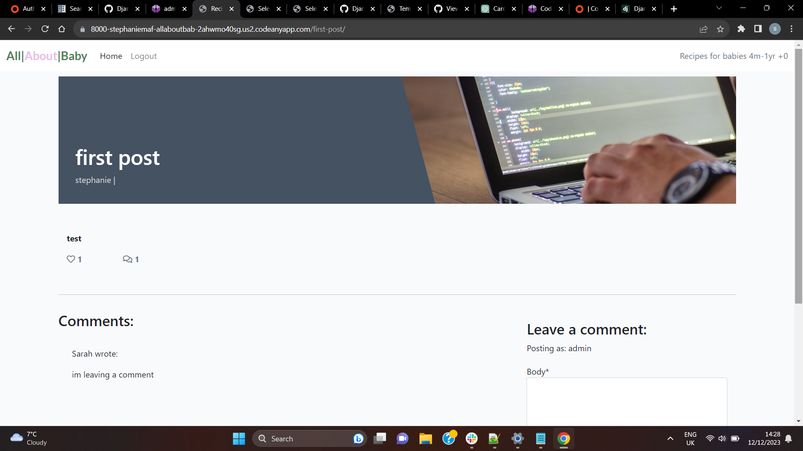
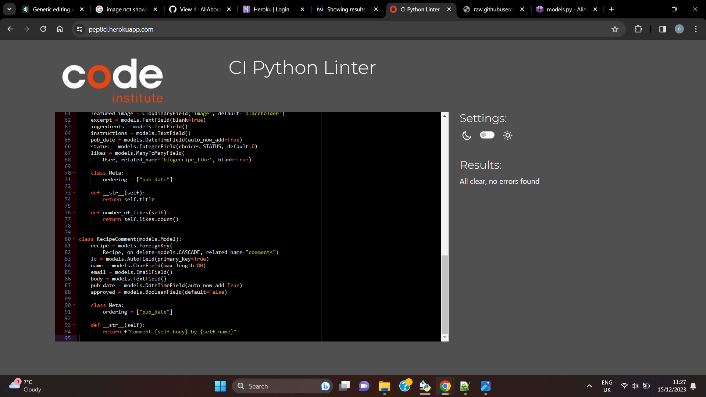
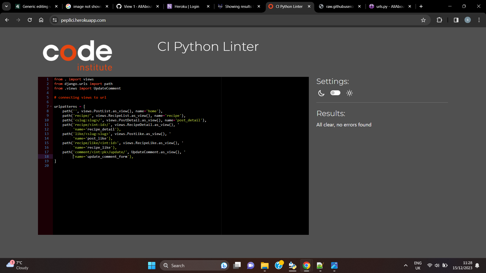
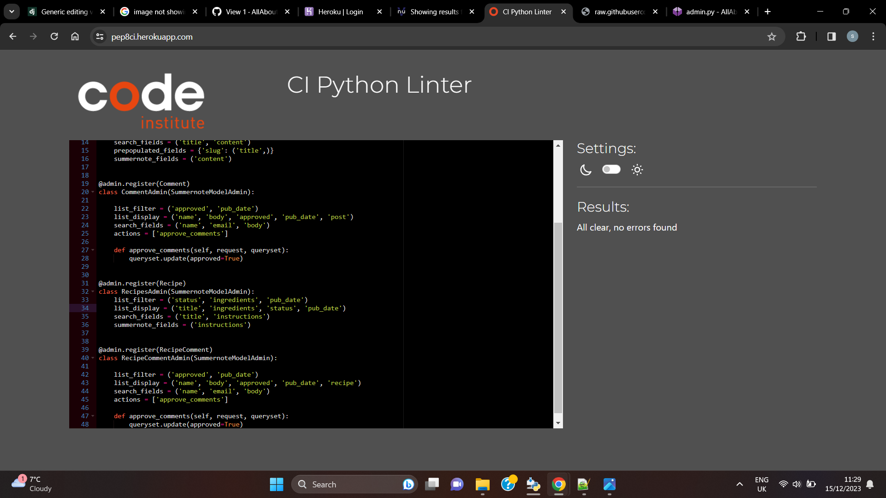
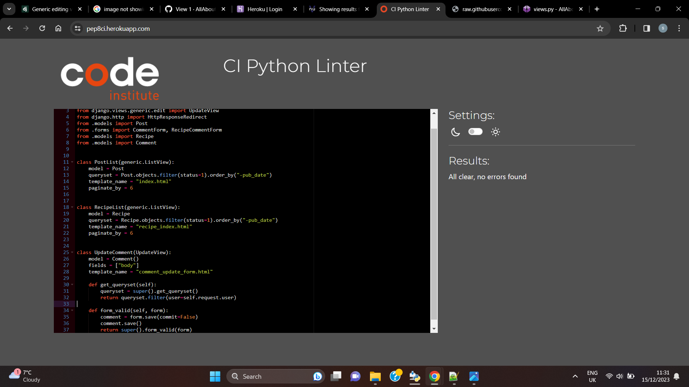

# Introduction

This is a blog created in Django. My Blog name is All About Baby. This Blog is intended to give users information about babies threw thier first year of life. The posts in this blog are related to baby development and feeding. There is a navigation bar at the top of the page and from the blog page you can navigate to a page with recipes. On this recipe page you will find recipes for feeding your baby there first foods. You are able to sign into this website and as an authenticated user you will be able to leave comments and like/unlike posts and recipes. You are to log out and register to the site also. There is an admin panel for Admin users the loh in information for his will be found at the end of this ReadMe.
The data base for my blog is hosted on [elephantsql](https://www.elephantsql.com/) 
The site will be deployed threw [Hreoku](https://id.heroku.com/)
Images stored on [cloudinary](https://cloudinary.com)

# How to begin

When you first get to my webside blog you can see posts and recipes by navigating through the nav bar at the top. If you want to leave comments you must register first as a user of the site. Once registered you will be able to not only see the posts and recipes but you will be able to leave comments on posts and you will be able to like them also.

Unfortunatly i ran out of time on this project and failed to implement features like an email list and social media sign up. which i intent to do

# Blog Functionality

## Templates

In the directories base.html is the main template and my other templates inherit from that 
Index.html is the form that handles displaying my blog posts and post_detailholds my comment form and ability to like posts.
For the recipe page i dublicated these templates and renamed them. so Recipe_index.html and Recipe_detail.html. These forms handle the recipe posts and comments respectivaly

## Authorisaton

djnago framworks have the ability to implement an admin feature here i am able to Approve comments before the can be seen by the user. I can write adn deploy my block posts and i can also create a user name and password from this admin site. On the admin panel there are roles and permissions. The abilty to create and admin and this person had the abily to preform all parts of crud on the site for each model. 

I wanted to implement the ability to edit and delete comments the user had made on the blogposts and recipes but after impletmenting the code from the [django documentation](https://docs.djangoproject.com/en/5.0/) but i could not get this to work for me just yet i will contuinue in my efforts to perfect this.

## Login and Registration

Threw Django i implemented login/logout abiliies and the ability to register as a user for the site. As a registered user you can like and unlike posts and you are able to vreate a passowrd to log in. You are able to change your password aswell if you have fogotten it.

## Database management

In order to create models and store recipes and blog posts i used [elephantsql](https://www.elephantsql.com/). When creating updateing or deleting parts of the models you make migrations threw the terminal window and this will update the database on elephantsql. These models where Post, Comment, and Recipe

## CRUD

By logging into the admin panel The super user has the ability to preform full crud functionality my creating posts deleting them, updating usernames and passwords. Users can read all posts like/and unlike posts create profiles and change login information. In the fuur i will be implementing the ability to delete user comments.

## Images

When creating blog posts users have the ability to use there own images and if they fail to upload one a default image has been provided in the index.html file.

## Testing

* I will be manually testing my Reciepe Blog for this project!

* To begin with i started testing the the Main page I began with the buttons! i tested each  navigation button first by hoovering my mouse over it to see would my hopover function correctly work which i found it did! I then clicked each
navigation button to be sure the links i created for the button would bring me to the correct page. They did. 
after that i went to each nav button on all my pages to see would the link continuously work as intended!

* Next i moved on to the blog page. I clicked into my first blog** as if i were a user I ecpected this to bring me into a page with the contect of the blog i clicked the reuslt was as intended and i was indeed brought to the content i was expecting to see. I then went to my like function to click that to see would it work and it did then i moved down to the comment section i left a comment as my logged in user which i then went to the admin page and approved the comment and when i returned to the blog post my comment was there!

I did the same on my recipe model was able to leave a comment. When i creatred the seperate page for recipes i uploaded a blog post to the site and made sure that it only posted to the recipe page and it did.

* To test the log in feature i created a sudonom and logged into the site as sarah she was ablel to register and create a passwprd i then went and tried to change her password and was successful

* To comment on the site i used sarahs accound and left a comment iI then logged in as my admin user and approved the comment. Initially the option to approve wasnt there and i had made an error with my comment model i went back and changed the model and then was able to approve sarahs comment 

# bugs

I wanted to implement the ability to edit and delete comments the user had made on the blogposts and recipes but after impletmenting the code from the [django documentation](https://docs.djangoproject.com/en/5.0/) but i could not get this to work for me just yet i will contu=inue in my efforts to perfect this.

# Validator Testing

## Tested on [Validator](https://pep8ci.herokuapp.com/)
Code passed through validator with no issues

# Credits 
I took ideas for this project from the code institute walkthrough I think therforeI blog/

# Important links
Link to my GitHup repository

# log in information

To get onto admin site Name: admin
                       Password: project4
and a user             Name: Sarah
                    Password: project4

                    
GIT log in Stephaniemaf
passoword AvaAlex!@

hoted on heroku

# notes
Before i started this module i had a baby and doing this project with a newborn was quite intense and difficult i wasnt able to put in the amount of work and time i was before and its reflected in my work i understand i may not pass today but in the mean time i will keep learning and hopfully if i need to resubmit it will be up to the standard i want and is needed. 