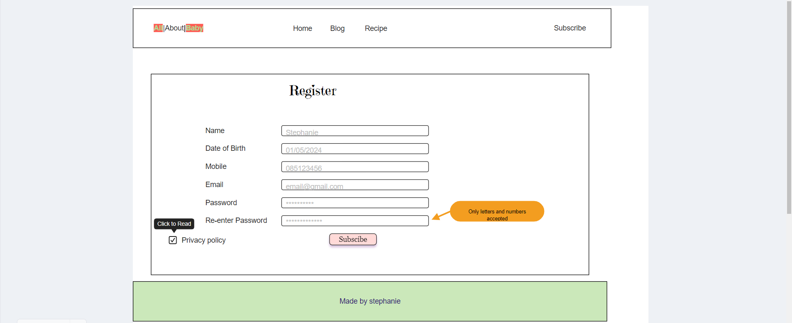

# Introduction

This is a blog created in Django. My Blog name is All About Baby. This Blog is intended to give users information about babies threw thier first year of life. The posts in this blog are related to baby development and feeding. There is a navigation bar at the top of the page and from the blog page you can navigate to a page with recipes. On this recipe page you will find recipes for feeding your baby there first foods. You are able to sign into this website and as an authenticated user you will be able to leave comments and like/unlike posts and recipes. You are to log out and register to the site also. There is an admin panel for Admin users the loh in information for his will be found at the end of this ReadMe.
The data base for my blog is hosted on [elephantsql](https://www.elephantsql.com/) 
The site will be deployed threw [Hreoku](https://id.heroku.com/)
Images stored on [cloudinary](https://cloudinary.com)

# How to begin

When you first get to my webside blog you can see posts and recipes by navigating through the nav bar at the top. If you want to leave comments you must register first as a user of the site. Once registered you will be able to not only see the posts and recipes but you will be able to leave comments on posts and you will be able to like them also.

Once you leave a comment you will see an edit and delete button under your own comment. If you click on either button you will be brought to a new form page. From here you can edit or delete your commetn depending on which button you clicked. Once the action has been preformed, you will be redirected back to the post or recipe that you clicked the button on.

# Blog Functionality

## Templates

In the directories base.html is the main template and my other templates inherit from that 
Index.html is the form that handles displaying my blog posts and post_detailholds my comment form and ability to like posts.
For the recipe page i dublicated these templates and renamed them. so Recipe_index.html and Recipe_detail.html. These forms handle the recipe posts and comments respectivaly. I have seperate forms for updating and deleting comments these also inhereit from base.html and i have templates ffor creating a recipe and subscribing to the newsletter.

## Authorisaton

Djnago framworks have the ability to implement an admin feature here i am able to Approve comments before the can be seen by the user. I can write adn deploy my blog posts and i can also create a user name and password from this admin site. On the admin panel there are roles and permissions. The abilty to create an admin(superuser) and this person had the abily to preform all parts of crud on the site for each model. 

As a registered site user you have the ability to create recipes for the blog and you are able to leave comments for both recipes and blog posts and you can also update and delete these comments. Therby manipulating the database from the front end as a user. 

## Login and Registration

Threw Djangos authentication system-openid, i implemented login/logout abiliies and the ability to register as a user for the site. As a registered user you can like and unlike posts and you are able to create a passowrd to log in. You are able to change your password aswell if you have fogotten it. 

## Database management

In order to create models and store recipes and blog posts i used [elephantsql](https://www.elephantsql.com/). When Creating,Updating or Deleting parts of the models you make migrations threw the terminal window in using the code - (python3 manage.py makemigrtaions) and if everything looks good you can proceed with (python3 manage.py migrate). This will update the database on elephantsql. These models are Post, Comment, Recipe and Subscribe

## CRUD

By logging into the admin panel The super user has the ability to preform full crud functionality my creating posts deleting them, updating usernames and passwords. Users can read all posts like/and unlike posts create profiles and change login information. Registered users of the site can Comment on Posts and Recipes, Like and Unlike posts they enjoy, Users and now Update(edit) and Delete their comments and now can add a Recipe they would like to share with others. Users must wait for admin approval of their comments and uploaded recipes and will recieve a message about this after they are redirected back to the page they where on when commenting or adding a recipe.

## Images

When creating blog posts users have the ability to use there own images and if they fail to upload one a default image has been provided in the index.html file.

## WireFrames and Mockups

When desgining this project i designed some mockuos of what i wanted this blog to look like i have linked these below.
First my basic diagram of what i planned:
.

First Basic moqup:

.

Next i have some more detailed mockups of each page i planned for the blog
.
.
.
.
.
.
.
.

I created my wireframes and mockups on [moqups](https://moqups.com/)

# Testing

I will be manually testing my Blog for this project!

## Home Page:
To begin with i started testing the the Home page.
The nav bar contains 5 nav links a background image with text overlay and a footer with 2 social media links.

### The nav bar:
Expectation = I expect to be able to click on each nav link and be brought to the page they are linked to.
Result = These worked as expected i clicked on each link and was brought to their respective pages untill i added the new home page nav link. When i first clicked this link it brought me to the blog page instead of the new home page.

Fix = I had to update the urls.py as origionally my blog page was called home and i renamed it to blog, so both url paths where leading to the blog page. [path('blog/', views.PostList.as_view(), name='blog'),] i had left the single quotes empty but adding blog here fixed my issue

The home page has a background image with text overlay. This is centered and stretched to fit the whole screen there are no buttons on links here

### The Footer:
Expectation = I expect the footer to have the words Made by stephanie and links to facebook and instagram. I want these links to lead to the home page of their respective sites.
Result = I clicked on each link and am brought to the front page of their respective sites.

# The Blog page:
To get here i clicked the blog nav link. On this page  i have blog posts. To test this i chose the first blog post on the page.

Expectation = I ecpected to click on the blog post and be brought to the post content where i would fine and image at the top of the page followed by the post content and under this a form for leaving comments on the bottom right and a list of comments on the left. I used content_type in my Comment model as i was using this model for both Blog posts and Recipes. I needed to use it to keep track of all my models in order to assign the right comments with theyre respective posts.

Result = I reloaded my terminal and recieved and a name error for content type

Fix = So i went back to my view page and imported content type at the top of the file and reloaded the page and there was no error now.

## Blog Post:
I clicked into the first post on the page as a logged OUT user.

Expectation = To see only featured image, Post content and commentbox heading.
Result = I did infavt only see featured image, Post content and commentbox heading.

I returned the main blog post page and looged in as a registered user

Expectation = To see featured image, Post content and commentbox heading and the form for leaving a comment
Result = I did infact only see featured image, Post content and commentbox heading and the form for leaving a comment. 

As i was signed in i tested the features of this page.
The like button when presses reloads the page and the favivon icon is filled in solid color indicating it has sussessfully been liked, a second click on the heart favivon will reload the page and unlike the post leaving a heart outline. The feature acted as normal.
I left a comment as a user and a pop up box showed saying "Your comment is awaiting approval". I went into the admin panel approved the new comment and clicked view site. I expected to go back to the post content and see my new comment, however there was no comment showing.

Fix = I looked at my database and i could see the comment was being saved however there was no post_id only content type_id. I went to my view page and looked at post detail and it seemed like the post field of the comment wasnt being set with the current post, so i added the code: comment.post = post and removed the content type code. Then i returned to the admin and approved a new comment, clicked view site and returned to the blog post. I could see the comment now, however now there was no information under content_type in the admin panel. I went back to my views.py and after the code comment.post = post i added comment.content_object = post, content_type = ContentType.objects.get_for_model(Post), comment.content_type = content_type and then saved the form. This fixed my issue and i was able to see the comment posted and also in the admin panel i could now see if it was a recipe post or a blog post.

# The Recipe page:
To get here i clicked the blog nav link. On this page  i have Recipe posts. To test this i chose the first Recipe post on the page.

Expectation = I ecpected to click on the Recipe post and be brought to the post content where i would fine and image at the top of the page followed by the Recipe content and under this a form for leaving comments on the bottom right and a list of comments on the left. I used content_type in my Comment model as i was using this model for both Blog posts and Recipes. I needed to use it to keep track of all my models in order to assign the right comments with theyre respective posts.

Result = I was successfully directed tot he post

## Recipe Post:
I clicked into the first post on the page as a logged OUT user.

Expectation = To see only featured image, Recipe content and commentbox heading.
Result = I did infact only see featured image, Post content and commentbox heading.

I returned the main Recipe post page and looged in as a registered user

Expectation = To see featured image, Post content and commentbox heading and the form for leaving a comment and a nav link for submitting a user recipe

Result = I did infact only see featured image, Post content and commentbox heading and the form for leaving a comment nd a nav link ofr submitting a user recipe. 

As i was signed in i tested the features of this page.
The like button when presses reloads the page and the favivon icon is filled in solid color indicating it has sussessfully been liked, a second click on the heart favivon will reload the page and unlike the post leaving a heart outline. The feature acted as normal.
I left a comment as a user and a pop up box showed saying "Your comment is awaiting approval". I went into the admin panel approved the new comment and clicked view site. I saw my comment and an edit and delete button under only my comment. I will test buttons in a later section.

I clicked on the link for submitting a user recipe i was redirected to a new page containing a form. This was intended and an ecpected result. Here i had form fields needed to suvmit a blog post the same as in the admin panel. when the form opens there is input boxes for Title, Author, Featured image, Ingredients, Instructions and a submit button. I enetered the correct information in all the fields was redirected back to the recipe blog page. 
I moved back to the admin panel and published the post. The new post was the first post now on the first row. I clicked into it and left a comment.

I approved comment in the admin panel 

After approving the comment i returned to the recipe and expected to see a comment and two buttons staying edit and delete

I am now testing the edit and delete buttons so i am expecting to click either button be redirected to the form linked to it and be able to either edit or delete the comment and be redirected back to the post or recipe. Ill start with edit.
I clicked the edit button and was brought to a form 

I changed the text on the comment and clicked update and redirected to the comment box and saw my comment had successfully updated 

So i moved onto the delete button. once pressed i was brought to a form asking if i was sure i wanted to delte the comment and the comment i was deleteing

after this i was redirected to the recipe post again and my comment was gonne.

## Subscribe
On my subscribe page i have a form for signing up to the newsletter. It contains a heading "Subscribe to our Newsletter and 4 input fields 

I entered the sudonom Alex and filled in the rest of the field as you would expect them to be filled with the correct information.

Expectation = I expected to go to the admin panel and unders Subcribes i expected to see Alexs Firstname and Lastname and Email,
Result = i saw the correct information.

.

I filled out the form with incorrect information to see how the input boxes would behave.

Expectation = I was expecting the email field to only allow properly configured email as i set it that way and i was expecting the phone number to only accept numbers and the name to only accept letters

Result = The email field worked as expected and did infact request a properly configured email of name@mail.com
.
unfortunaly the other input boxes would not give the same error. and phone number accpted letters and name accepted numbers

Fix = I did not fix this but that is a feature i would like to implement in future updates.

## Buttons
After testing the buttons on the recipe page i recreated the test on the blog page and was met with the same successful results.I tested the update and delete buttons in the forms and was also as expected. as where all the input forms across the blog and recipe pages.

## Login/Logout/Regisstration

These features are implemented threw Djangos AllAuth system. These all work as expected and the user in registered and able to complete all features documented above in readme and as you can see from screenshots linked throughout the readme file. 

Logging in and out
# bugs  
Right now a known bug to me is when i add a recipe from the admin panel and type in the text editor upon posting the p tags are present in the recipe this is an error i would like to fix in furture upates. 
Another open bug i am aware of is the input fields in the subscribe form accepting numbers and letters where it is not appropriate 
So towards the end i could not access my project anymore so i have to clone the repository and set up a new one on gitpod using the gitpod template. This cause an unexpected bug where everytime i open the project from github gitpod redownloads all packages and libraries in the requirements.txt file and i have to create a new env.py file and import database urls and keys and then in setings.py i have to add a new allowed host.

# Validator Testing

## Tested on [Validator](https://pep8ci.herokuapp.com/)
Code passed through validator with no issues

[CssValidator](https://jigsaw.w3.org/css-validator/validator)

# Credits 
I took ideas for this project from the code institute walkthrough I think therforeI blog.

* Hosted on heroku

# notes
Before i started this module i had a baby and doing this project with a newborn was quite intense and difficult i wasnt able to put in the amount of work and time i was before and its reflected in my work i understand i may not pass today but in the mean time i will keep learning and hopfully if i need to resubmit it will be up to the standard i want and is needed. 

I started this project on app.codeanywhere however towards the end the free hours ran out which i think was a new unexpected feature as i hadnt had this issue before. So towards the end i could not access my project anymore so i have to clone the repository and set up a new one on gitpod using the gitpod template. This cause an unexpected bug where everytime i open the project from github gitpod redownloads all packages and libraries in the requirements.txt file and i have to create a new env.py file and import database urls and keys and then in setings.py i have to add a new allowed host. I will detail these steps in the project submission page to avoid leaving secrets on this readme.
